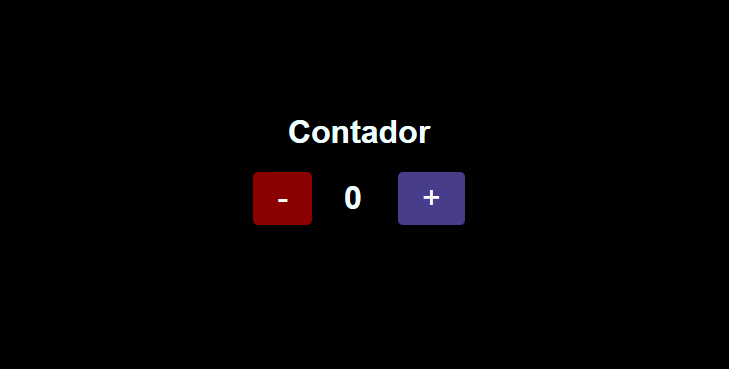

# Blog

#### Segundo projeto do curso de React Direto ao Ponto

## 🎯 Objetivo

Este é um projeto simples de um contador, que tinha como objetivo aprender o conceito de useState em React JS.

## 🚀 Como executar o projeto

1. Clone este repositório

`$ git clone https://github.com/giovanaraphaelli/counter.git`

2. Acesse a pasta do projeto no seu terminal/cmd

`$ cd counter`

3. Abra a pasta do projeto no VS Code via terminal/cmd

`$ code .`

4. Instale as dependências

`$ yarn install`

5. Execute a aplicação em modo de desenvolvimento

`$ yarn start`

6. A aplicação será aberta na porta: 3000 - acesse http://localhost:3000
